# PAnTHErS HowTo


[TOC]

## Prerequisites
First get a PAnTHErS  installation up and ready, following instructions from README.md file.

## Notations

HE scheme: Homomorphic Encryption scheme

## Interface Startup

Begin by starting your PAnTHErS  interface:

Go to your Sage build folder and start Sage with the following command:

```
$> cd /path/to/SageMath
$> ./sage
```

From Sage prompt, go to PAnTHErS interface folder and launch the interface:

```
$sage: cd
$sage: cd panthers/Interface
$sage: load("interface.py")
```

PAnTHErS interface should pop-up.

| 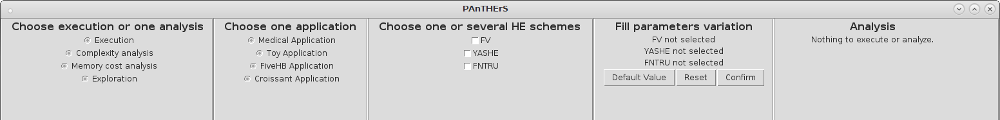 |
| ------------------------------------------- |
| *PAnTHErS Interface at startup*|


## Application Analysis or Execution

This part shows how to use PAnTHErS Interface in order to analyze or execute an application using one or several HE schemes.

### 1. Analysis selection

Select the kind of analysis you want to perform from the first interface pane:

| 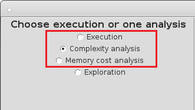 |
| ----------------------------------------- |
| *Analysis selection from first pane* |

You can either choose:

- **Execution**: Execute all parameters combinations for a given application and HE schemes selection.
- **Complexity analysis**: Get an estimation of execution time in seconds required for all parameters combinations for a given application and HE schemes selection.
- **Memory cost analysis**: Get an estimation of memory cost in mebibytes (MiB) required for all parameters combinations for a given application and HE schemes selection.

### 2. Application and HE scheme(s) selection

Select the application and HE schemes to analyze or execute from the second and third interface pane:

| 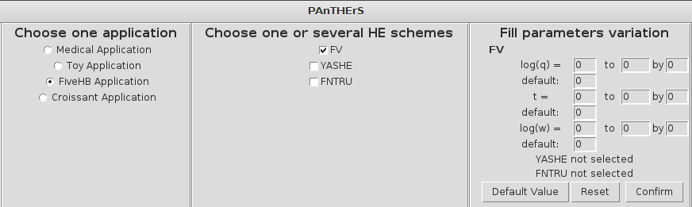 |
| ----------------------------------------- |
| *Application and HE schemes selection: one scheme selected* |

You can either choose one or more HE schemes. For each scheme selected, its parameters show up in the 4th interface pane.

|            |
| ------------------------------------------------------------ |
| *Application and HE schemes selection: several schemes selected* |


### 3. Fill HE schemes parameters variation

Fill HE schemes parameters with default values and ranges of values.

> :warning: **Important:** You need at least one parameter with a range of values per HE scheme.
>

> :warning: **Important:** For each parameter value you have to provide a default value. This value is used when the HE scheme is executed or analyzed using varying values for another parameter.
>

| 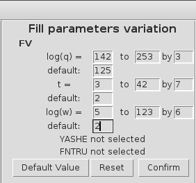 |
| ------------------------------------------------------------ |
| *Selection of custom parameter values or range of values for HE schemes* |


Parameters values can be globally reset to 0 using the *Reset* button:

| 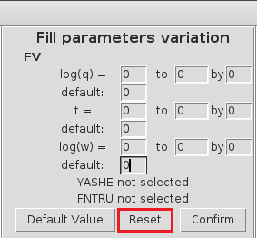 |
| ------------------------------------------------------------ |
| *Reset HE schemes parameter values* |

Parameters values can be set to a default value using the *Default Value* button.
These default values can be used to quickly test the interface.

> :warning: Default values are currently only valid for the *FiveHB* Application
>

| 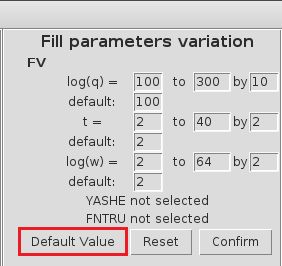 |
| ------------------------------------------------------------ |
| *Set default values for HE schemes parameters* |


Validate the HE schemes parameters values using the Confirm button.
In the last pane of the interface, a brief summary of all analysis configuration is shown:

| 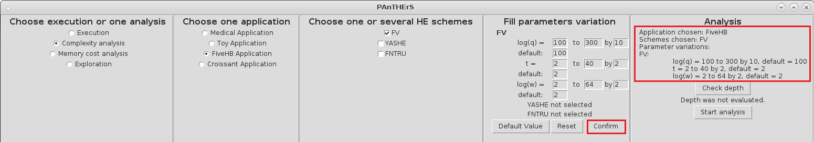 |
| ------------------------------------------------------------ |
| *Validation of HE schemes parameters values* |

### 4. Optional: Check multiplicative depth

Before starting the execution or analysis, you can check that HE schemes parameters values provide sufficient multiplicative depth for the selected application. To check the multiplicative depth click on the *Check depth* button.

| 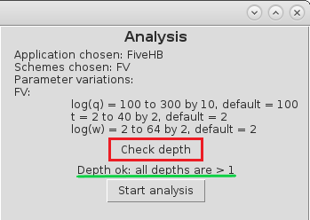 |
| ------------------------------------------------------------ |
| *Checking HE schemes parameters multiplicative depth* |

If the multiplicative depth test fails, it means that theoretically at least one set of selected values will not provide enough multiplicative depth to perform homomorphic encryption.
In this case you can go back to the value selection phase to select different values.

| 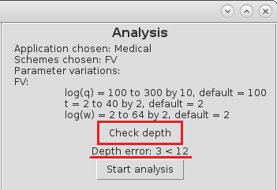 |
| ------------------------------------------------------------ |
| *HE schemes parameters do not provide enough multiplicative depth* |

### 5. Start execution or analysis

Start the execution or analysis by clicking on the *Start analysis* button. 
A progress bar shows informations about execution/analysis evolution.

| 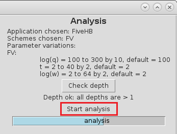 |
| ------------------------------------------------------------ |
| *Start analysis or execution* |


Once execution/analysis is finished, a success message is prompted in the last interface pane, and a *Display Graphs* button appears. 

| 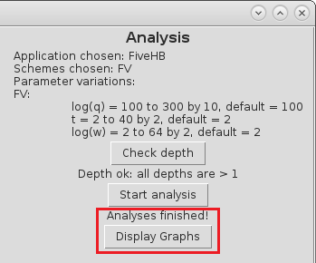 |
| ------------------------------------------------------------ |
| *Success message and Display Graphs button, shown at the end of analysis/execution process* |

### 6. Execution or analysis results

Results can be viewed as graphs by clicking on the *Display Graphs* button.

| 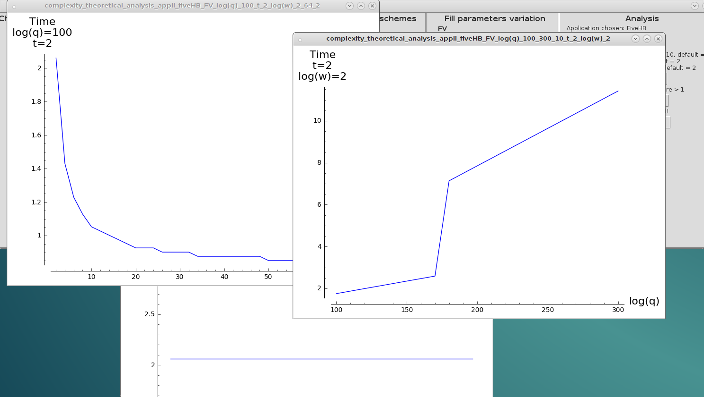 |
| ------------------------------------------------------------ |
| *Results shown after clicking on Display Graphs button* |

All result values are stored in CSV files in following directory:

```
/path/to/panthers/Interface/Res
```

Graphs obtained from these results can be found in following directory:

```
/path/to/panthers/Interface/Res/Graphs
```


| 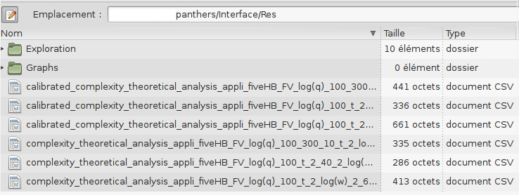 |
| ------------------------------------------------------------ |
| *CSV files containing execution/analysis results* |


| 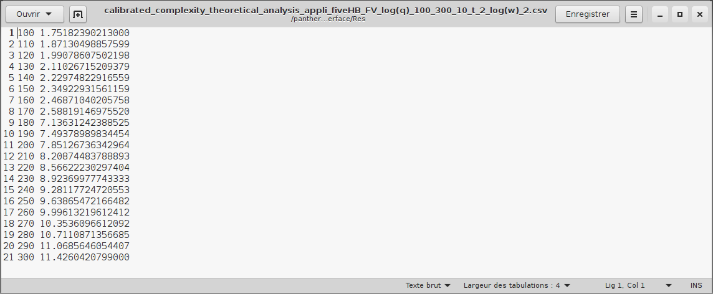 |
| ------------------------------------------------------------ |
| *Results contained in a CSV file* |

## Application Exploration

This part shows how to use PAnTHErS Interface in order to explore all parameters of one or several HE schemes to find optimal parameter sets for a given application.

### 1. Exploration selection

Select the exploration mode from the first pane of the interface.

| 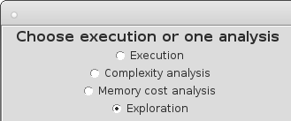 |
| ------------------------------------------------------------ |
| *Selection of the exploration mode* |


Select the kind of exploration you want to perform. You can choose from:

- **Low complexity**: Exploration will select results inducing lowest execution time.
- **Low memory cost**: Exploration will select results inducing lowest memory consumption.
- **Best compromise**: Exploration will select results based on a tradeoff of the two criteria above.

| 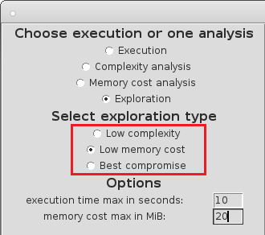 |
| ------------------------------------------------------------ |
| *Selection of the exploration type* |

> :bulb: **Optional**: You can set constraints on the results selected by the exploration by providing maximum values allowed for execution duration and/or memory cost.
>
>| 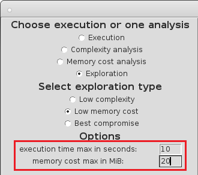 |
>| ------------------------------------------------------------ |
>| *Selection of optional constraints* |
>


### 2. Application selection

Select the application to explore from the second interface pane:

| 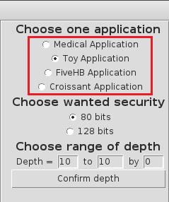 |
| ----------------------------------------- |
| *Application selection* |

After application selection, you have to select the level of security for the HE schemes (80 or 128 bits).

| 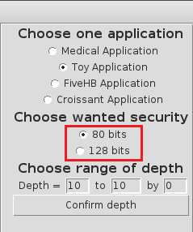 |
| ----------------------------------------- |
| *Level of security selection* |

The multiplicative depth is automatically updated to fit the application selected.
| 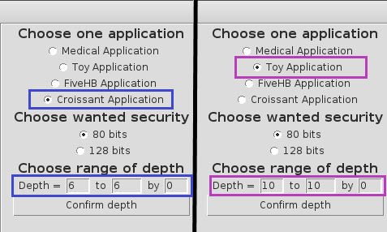 |
| ----------------------------------------- |
| *Multiplicative depth is automatically updated when an application is selected* |


> :bulb: **Optional**: You can choose a larger range for the multiplicative depth, but the lower depth bound must not be chosen under automatically selected value.
>
>| 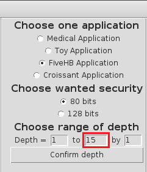 |
>| ----------------------------------------- |
>| *Choosing custom multiplicative depth* |
>

Finalize application selection by clicking on the *Confirm depth* button. 

| 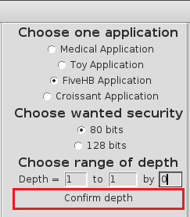 |
| ------------------------------------------------------------ |
| *Validation of multiplicative depth by clicking on Confirm depth button* |

### 3. HE schemes and parameters variation selection

After confirmation of mutiplicative depth, all available HE schemes are selected for current exploration.

| 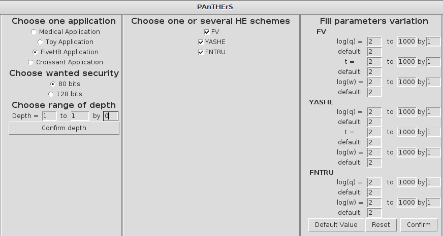 |
| ------------------------------------------------------------ |
| *After multiplicative depth confirmation, all HE schemes are selected* |

>:bulb: **Optional**: You can deselect unwanted schemes by unticking them from the HE schemes pane
>
>
>| 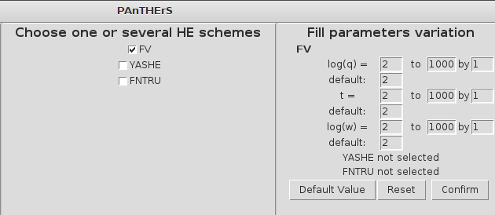 |
>| ------------------------------------------------------------ |
>| *Deselection of unwanted HE schemes* |
>


The parameter values for selected HE schemes are automatically filled with chosen values. 

>:bulb: **Optional**: You can change the size of the exploration space by selecting parameters variation as [detailed](#3.-fill-he-schemes-parameters-variation) for Analysis/Execution mode.
>
>
>| 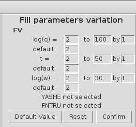 |
>| ------------------------------------------------------------ |
>| *Selection of custom parameter values or range of values for HE schemes* |
>

Validate the HE schemes parameters values using the Confirm button.
In the last pane of the interface, a brief summary of exploration configuration is shown:

| 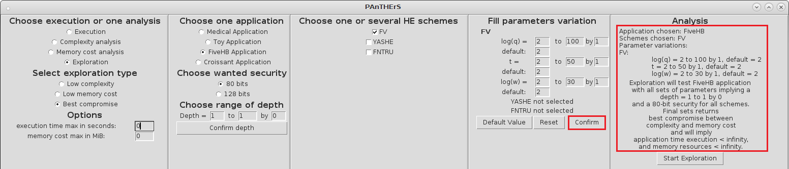 |
| ------------------------------------------------------------ |
| *Validation of HE schemes parameters values* |

### 4. Start exploration


Start the exploration by clicking on the *Start Exploration* button. 
A progress bar shows informations about exploration evolution.

| 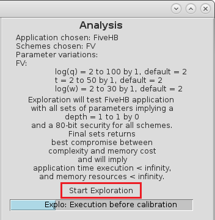 |
| ------------------------------------------------------------ |
| *Start exploration* |


Once exploration is finished, a success message is prompted in the last interface pane, and a *Display Graphs* button appears. 

| 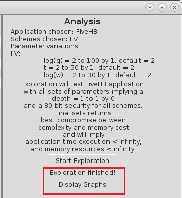 |
| ------------------------------------------------------------ |
| *Success message and Display Graphs button, shown at the end of the exploration process* |


### 5. Exploration results

Results can be viewed as graphs by clicking on the *Display Graphs* button.

| 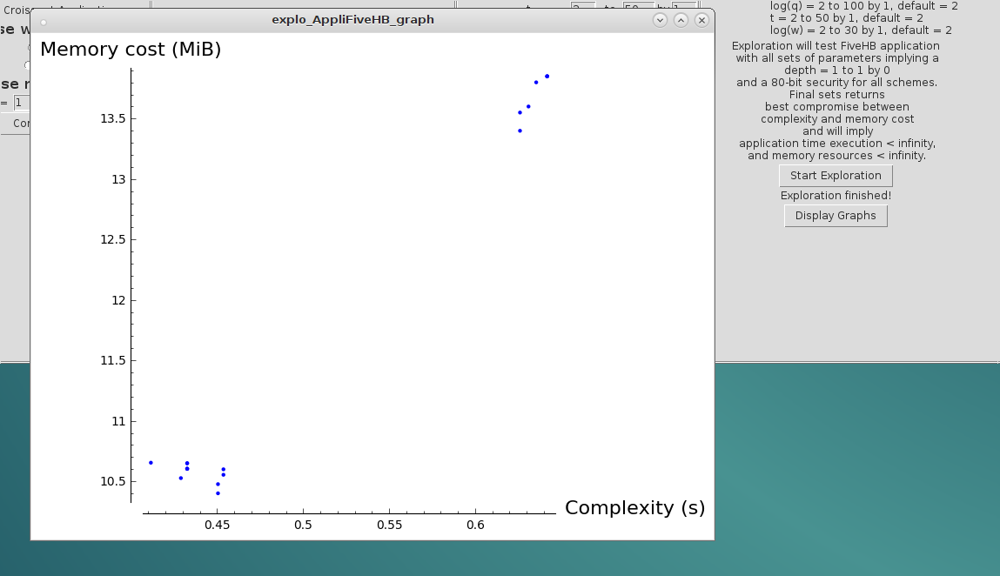 |
| ------------------------------------------------------------ |
| *Results of exploration shown after clicking on Display Graphs button* |

All explorations result values are stored in CSV files in following directory:

```
/path/to/panthers/Interface/Res/Exploration
```

Graphs obtained from these results can be found in following directory:

```
/path/to/panthers/Interface/Res/Graphs
```


| 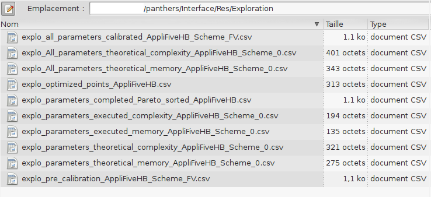 |
| ------------------------------------------------------------ |
| *CSV files containing exploration results* |


| 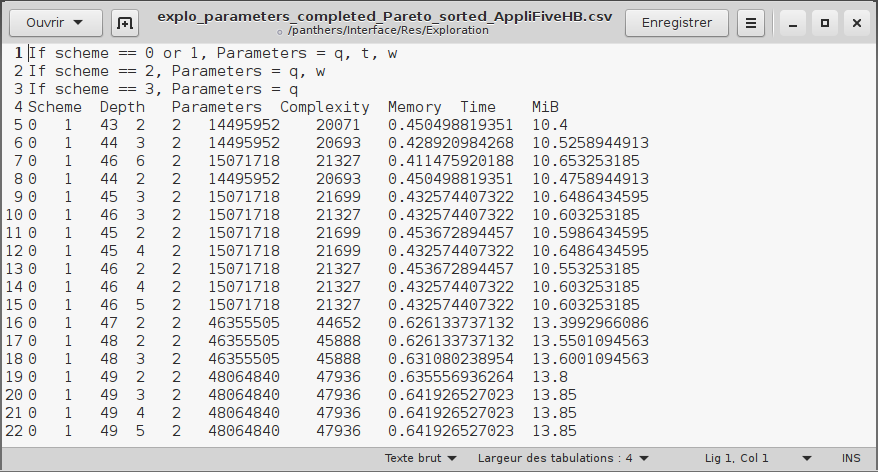 |
| ------------------------------------------------------------ |
| *Results contained in a CSV file* |


This file is distributed under the [CeCILL 2.1 License](http://www.cecill.info).
See the License.txt file for more details.

© 2018 Cyrielle Feron - ENSTA Bretagne


